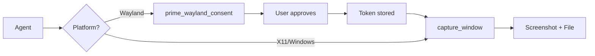

# screenshot-mcp

> **Cross-platform screenshot MCP server for coding agents**

Capture application windows on Linux (Wayland/X11), Windows, and macOS via the Model Context Protocol.

**Version:** 0.6.0 | [Changelog](./CHANGELOG.md)

## Status

| Platform | Backend | Status |
|----------|---------|--------|
| Linux | Wayland | ✅ Production-ready (portal + restore tokens) |
| Linux | X11 | ✅ Production-ready (direct capture) |
| Windows | WGC | ✅ Production-ready (Graphics Capture API) |
| macOS | ScreenCaptureKit | 📅 Planned (M5) |

## Quick Start

```bash
git clone https://github.com/username/screenshot-mcp.git
cd screenshot-mcp
cargo build --release
```

> **Need dependencies?** See [Platform Setup](./docs/setup.md) for Linux packages or Windows build tools.

### Configure Claude Desktop

**Linux:** `~/.config/Claude/claude_desktop_config.json`
**Windows:** `%APPDATA%\Claude\claude_desktop_config.json`

```json
{
  "mcpServers": {
    "screenshot": {
      "command": "/path/to/screenshot-mcp",
      "env": { "RUST_LOG": "screenshot_mcp=info" }
    }
  }
}
```

## Tools

| Tool | Description |
|------|-------------|
| `health_check` | Detect platform and backend status |
| `list_windows` | Enumerate capturable windows |
| `capture_window` | Screenshot a window (with crop/scale options) |
| `prime_wayland_consent` | Wayland-only: initiate permission flow |

## How It Works



**Wayland:** Requires one-time consent via portal dialog. Token enables headless captures afterward.

**X11 / Windows:** Direct capture—no consent flow needed.

## Output

Every capture returns:
- **Image data:** Base64-encoded WebP (default), PNG, or JPEG
- **File link:** Timestamped file in temp directory
- **Metadata:** Dimensions, format, size, and capture options

```json
{
  "content": [
    { "type": "image", "mimeType": "image/webp", "data": "UklGR..." },
    { "type": "text", "text": "[Screenshot](file:///tmp/screenshot-mcp/screenshot-2025-01-01.webp)" },
    { "type": "text", "text": "## Capture Metadata\n{\"dimensions\": [1920, 1080], \"format\": \"webp\"}" }
  ]
}
```

### Capture Options (v0.6.0+)

| Option | Default | Description |
|--------|---------|-------------|
| `format` | `webp` | Output format: `webp`, `png`, `jpeg` |
| `quality` | `80` | Compression (0-100, for webp/jpeg) |
| `scale` | `1.0` | Resize factor (0.1-2.0) |
| `includeCursor` | `false` | Include cursor in capture |
| `region` | - | Crop area `{x, y, width, height}` |

## Documentation

| Document | Purpose |
|----------|---------|
| [**Usage Guide**](./docs/usage.md) | API reference, workflows, examples |
| [**Platform Setup**](./docs/setup.md) | Installation for Linux/Windows |
| [**Troubleshooting**](./docs/troubleshooting.md) | Common errors and fixes |
| [**Architecture**](./docs/architecture.md) | Backend internals and design |
| [**Development**](./docs/development.md) | Testing, contributing, releases |
| [**Specification**](./specs/01-specification-v1.0.md) | Formal protocol specification |

## Performance

| Backend | P95 Latency |
|---------|-------------|
| Wayland | ~300ms (headless) |
| X11 | ~400ms |
| Windows | ~300ms |

See [development.md](./docs/development.md#performance) for tuning tips.

## License

MIT
