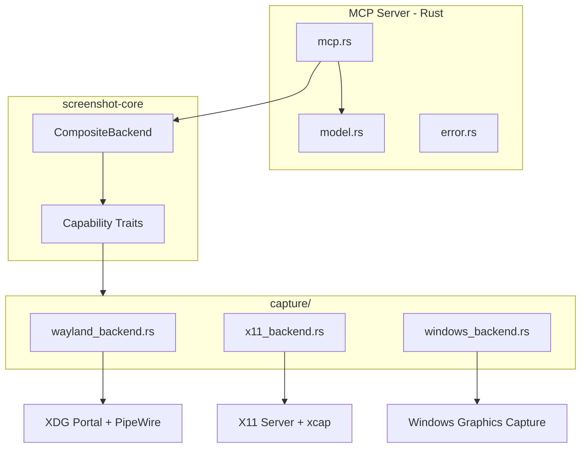
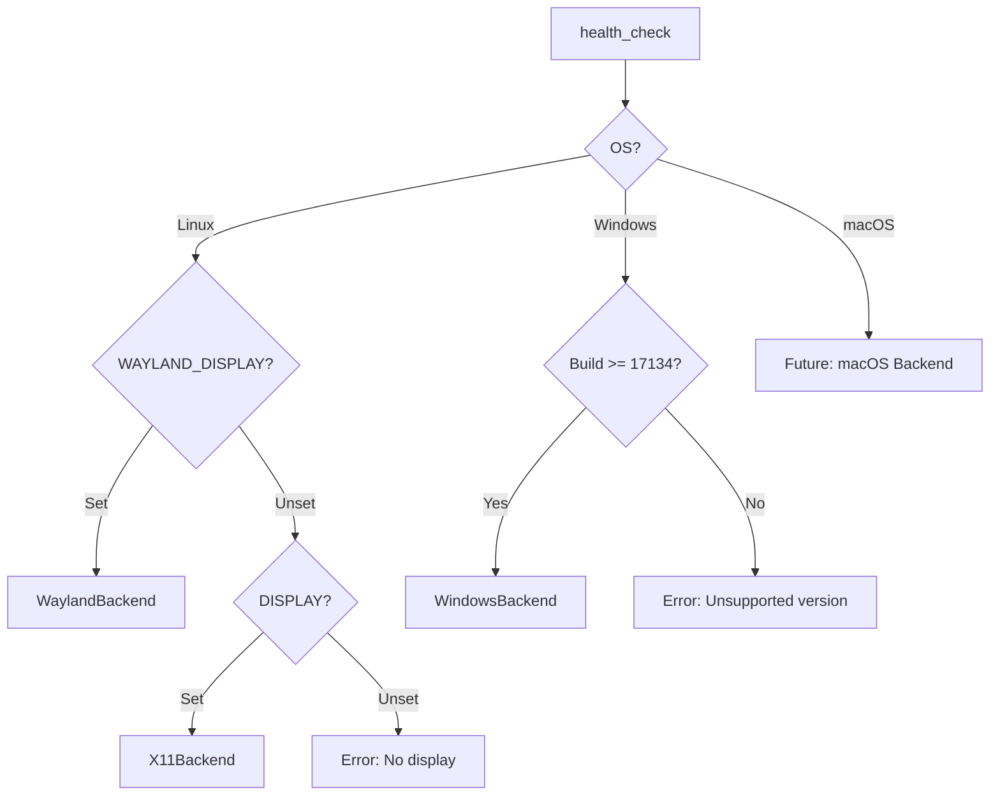
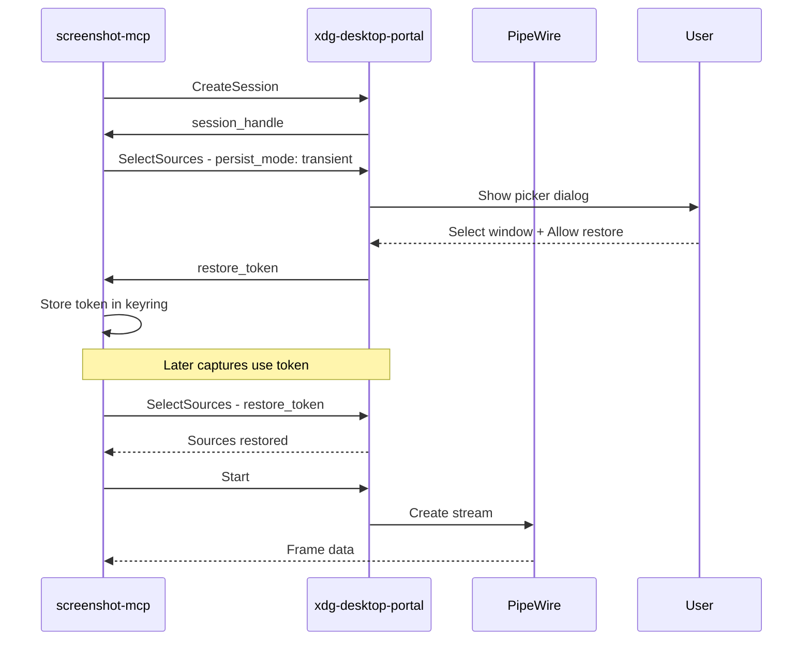
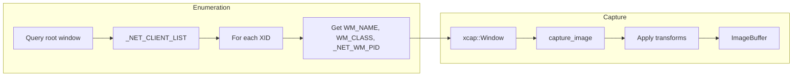
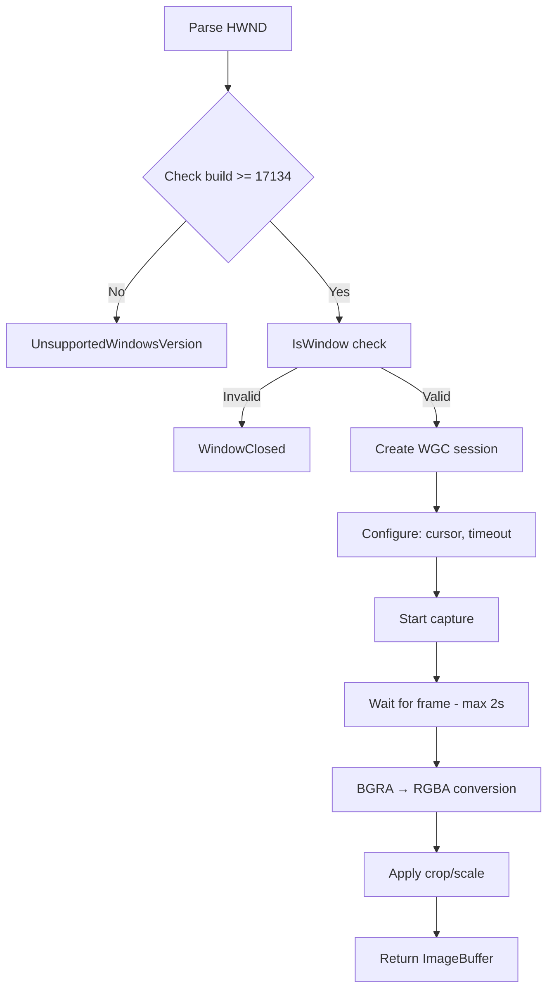
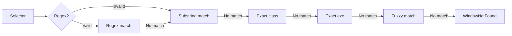
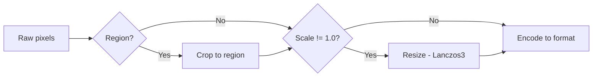

# Architecture

Technical deep-dive into screenshot-mcp backends.

## System Overview



### Capability Traits (v0.6.0+)

Backends implement fine-grained capability traits instead of a monolithic facade:

| Trait | Purpose | Backends |
|-------|---------|----------|
| `WindowEnumerator` | List capturable windows | X11, Windows, Mock |
| `WindowResolver` | Resolve selectors to handles | All |
| `ScreenCapture` | Capture screenshots | All |
| `WaylandRestoreCapable` | Wayland token workflow | Wayland |
| `BackendCapabilities` | Query feature support | All |

```rust
// Type-safe capability access via CompositeBackend
let backend = create_default_backend()?;

// Check if window enumeration is available
if let Some(enumerator) = backend.enumerator.as_ref() {
    let windows = enumerator.list_windows().await?;
}

// Capture always available
let image = backend.capture.capture_window(handle, &opts).await?;
```

---

## Backend Selection



---

## Wayland Backend

### Token-Based Consent Flow



### Key Components

| Component | Purpose |
|-----------|---------|
| `KeyStore` | Secure token storage (keyring or encrypted file) |
| `WaylandSource` | Represents a capture source with metadata |
| `PersistMode` | Controls token persistence behavior |

### Token Storage

- **Keyring (preferred):** gnome-keyring or kwallet
- **Fallback:** `~/.local/share/screenshot-mcp/token-store.enc` (ChaCha20-Poly1305)

### Compositor Compatibility

| Compositor | Portal Backend | Token Support |
|------------|----------------|---------------|
| GNOME 40+ | xdg-desktop-portal-gtk | ✅ Full |
| KDE Plasma 5.27+ | xdg-desktop-portal-kde | ✅ Full |
| Sway 1.5+ | xdg-desktop-portal-wlr | ⚠️ Limited |
| Hyprland | xdg-desktop-portal-hyprland | ⚠️ Limited |

---

## X11 Backend

### Direct Capture Flow



### EWMH Atoms

| Atom | Purpose |
|------|---------|
| `_NET_CLIENT_LIST` | List of managed windows |
| `_NET_WM_NAME` | UTF-8 window title |
| `WM_NAME` | Fallback Latin-1 title |
| `WM_CLASS` | Window class/instance |
| `_NET_WM_PID` | Owner process ID |

### Connection Management

- Lazy initialization on first use
- Automatic reconnection on error
- Health check via `get_input_focus()`

---

## Windows Backend

### WGC Capture Flow



### Window Matching Strategies

Tried in order until match found:



| Strategy | Input | Notes |
|----------|-------|-------|
| Regex | `title` | 1MB limit for ReDoS safety |
| Substring | `title` | Case-insensitive |
| Class | `class` | Exact match |
| Exe | `exe` | Process name |
| Fuzzy | `title` | SkimMatcher, threshold 60/100 |

### Frame Conversion

WGC returns BGRA; we convert to standard RGBA:

```text
WGC:  [B][G][R][A] → Swap → [R][G][B][A]
```

---

## Transformations

Applied after capture, before encoding:



**Order matters:** Cropping before scaling is more efficient.

---

## Error Handling

All backends use `CaptureError` with `remediation_hint()`:

```rust
pub enum CaptureError {
    PortalUnavailable { message: String },
    WindowNotFound { selector: String },
    PermissionDenied { reason: String },
    CaptureTimeout { duration_ms: u64 },
    // ...
}

impl CaptureError {
    pub fn remediation_hint(&self) -> &str {
        match self {
            Self::PortalUnavailable { .. } =>
                "Install xdg-desktop-portal and a backend",
            Self::WindowNotFound { .. } =>
                "Run list_windows to see available targets",
            // ...
        }
    }
}
```

---

## Timeout Strategy

| Operation | Timeout | Rationale |
|-----------|---------|-----------|
| list_windows | 1.5s | ~50 windows × 30ms metadata |
| capture_window | 2.0s | GPU scheduling, large frames |
| prime_wayland_consent | 30s | Waiting for user interaction |

---

## Capabilities by Backend

| Feature | Wayland | X11 | Windows |
|---------|---------|-----|---------|
| Window enumeration | Portal | EWMH | Win32 |
| Hardware acceleration | Yes | No | Yes |
| Cursor capture | With token | No | Yes |
| Region crop | Yes | Yes | Yes |
| Scaling | Yes | Yes | Yes |
| Requires consent | Yes | No | No |

---

## Performance Characteristics

### Latency Breakdown

| Phase | Wayland | X11 | Windows |
|-------|---------|-----|---------|
| List windows | <10ms | ~150ms | <50ms |
| Frame capture | ~100ms | ~50ms | ~50ms |
| PNG encoding | 100-200ms | 100-200ms | 100-200ms |
| **Total P95** | ~300ms | ~400ms | ~300ms |

### Optimization Tips

1. **Use WebP (default)** — best quality/size ratio for agent interactions
2. **Scale down** — `scale: 0.5` reduces pixels by 75%
3. **Crop to ROI** — only capture what you need
4. **Cache window IDs** — avoid repeated enumeration
5. **Use JPEG for speed** — faster encoding when latency is critical

---

## FAQ

**Why does WGC require Windows 10 1803+?**
Windows Graphics Capture API was introduced in that version. Older systems lack the required COM interfaces.

**Can I capture over SSH?**
- **X11:** Yes, with `ssh -X` forwarding (may be slow)
- **Wayland:** No, portal dialogs require local desktop session
- **Windows:** No, requires active desktop session

**Why is the first capture slower?**
Session initialization overhead: GPU memory allocation, shader compilation. Subsequent captures reuse the session.

**What causes capture timeouts?**
Usually GPU driver issues, unresponsive overlay apps (Discord, OBS), or very large frames (4K+). Try scaling down or updating drivers.
