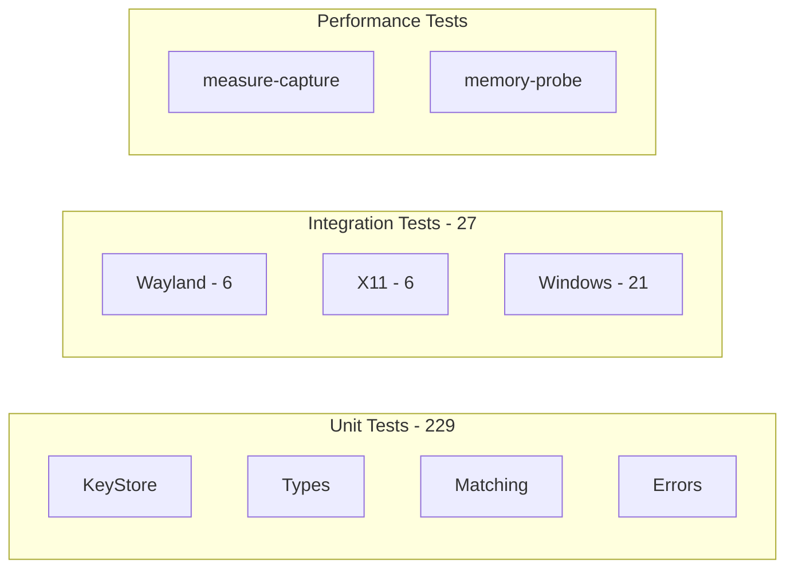

# Development Guide

Testing, performance tuning, and contributing to screenshot-mcp.

---

## Quick Commands

```bash
# Build
cargo build --release

# Lint
cargo clippy --all-targets --all-features -- -D warnings

# Format
cargo fmt

# Test (all)
cargo test --all-features

# Test (single)
cargo test TEST_NAME -- --nocapture

# Full CI check
just ci  # or: cargo fmt --check && cargo clippy && cargo test
```

---

## Testing

### Test Categories



### Running Tests

```bash
# Unit tests (CI-safe, no display required)
cargo test --all-features

# Integration tests - Linux/Wayland
./scripts/run_wayland_integration_tests.sh

# Integration tests - Linux/X11
DISPLAY=:0 cargo test --test x11_integration_tests -- --ignored --nocapture

# Integration tests - Windows
cargo test --test windows_integration_tests -- --ignored --nocapture
```

### Integration Test Prerequisites

| Backend | Requirements |
|---------|--------------|
| Wayland | Live compositor, `xdg-desktop-portal`, PipeWire |
| X11 | `DISPLAY` set, open windows |
| Windows | Desktop session, visible windows |

### Image Validation

Tests validate actual pixel data, not just dimensions:

```rust
// Layer 1: Bytes exist
assert!(!image.as_bytes().is_empty());

// Layer 2: Size matches dimensions
assert!(bytes.len() >= width * height * 3);

// Layer 3: Pixel variation (not blank)
let non_zero = bytes.iter().filter(|&&b| b != 0).count();
assert!(non_zero as f64 / bytes.len() as f64 > 0.3);

// Layer 4: Transforms reduce size
assert!(cropped.len() < full.len());
```

---

## Performance

### Latency Targets

| Metric | Target |
|--------|--------|
| Prime consent | <5s (excluding user) |
| Headless capture (P95) | <2s |
| Token rotation | <100ms |
| Memory peak | <200MB |

### Optimization Strategies

#### 1. Image Format

| Format | Speed | Size | Use Case |
|--------|-------|------|----------|
| PNG | Slow | Large | Text-heavy content |
| JPEG | Fast | Small | General UI (recommended) |
| WebP | Medium | Smallest | Best compression/quality |

**Recommendation:** `format: "jpeg", quality: 80` for agent interactions.

#### 2. Scaling

```json
{ "scale": 0.5 }  // 75% reduction in pixels
```

4K capture (3840×2160) = ~33MB raw → 0.5 scale = ~8MB

#### 3. Region Cropping

```json
{ "region": { "x": 100, "y": 100, "width": 800, "height": 600 } }
```

Only process pixels you need.

### Benchmarking

```bash
# Performance measurement
cargo run --bin measure-capture --features perf-tests

# Memory profiling
./scripts/run_memory_probe.sh

# Performance suite
./scripts/run_performance_suite.sh
```

---

## Code Style

- **Edition:** 2024
- **MSRV:** 1.75
- **Line width:** 100 characters
- **Imports:** Group by std/external/crate

### Error Handling

```rust
// ✅ Good - use thiserror + CaptureResult
fn capture() -> CaptureResult<ImageBuffer> {
    let window = find_window().map_err(|e| CaptureError::WindowNotFound {
        selector: selector.to_string(),
    })?;
    Ok(capture_impl(window)?)
}

// ❌ Bad - unwrap outside tests
fn capture() -> ImageBuffer {
    find_window().unwrap()  // Don't do this
}
```

All errors must implement `remediation_hint()`.

---

## CI Pipeline

```yaml
jobs:
  test:
    - cargo fmt --check
    - cargo clippy --all-targets --all-features -- -D warnings
    - cargo test --all-features
    - cargo test --features integration-tests --no-run  # Compile only

  build:
    - cargo build --release
    - cargo build --bin measure-capture --features perf-tests
```

Integration tests are **not** run in CI (no display environment).

---

## Release Process

### Pre-Release Checklist

- [ ] All tests pass: `cargo test --all-features`
- [ ] Lints clean: `cargo clippy -- -D warnings`
- [ ] Format check: `cargo fmt --check`
- [ ] Docs build: `cargo doc --no-deps`
- [ ] Version bumped in `Cargo.toml`
- [ ] CHANGELOG.md updated

### Release Steps

```bash
# 1. Commit changes
git add .
git commit -m "chore: prepare release v0.5.0"

# 2. Tag release
git tag v0.5.0
git push origin main --tags
```

GitHub Actions will:
- Build binaries for Linux/Windows
- Create GitHub Release
- Attach artifacts

### Post-Release

- [ ] Edit GitHub Release notes
- [ ] Update TODO.md with next milestone
- [ ] Announce if appropriate

---

## Packaging Roadmap

| Platform | Format | Status |
|----------|--------|--------|
| GitHub | Binary releases | ✅ Available |
| Linux | .deb, .rpm | 📅 Planned |
| Linux | AUR, Nix | 📅 Planned |
| Windows | MSI, Scoop | 📅 Planned |
| macOS | Homebrew | 📅 Planned (after M5) |

---

## Project Structure

```text
screenshot-mcp/
├── src/
│   ├── main.rs           # Entry point
│   ├── lib.rs            # Library exports
│   ├── mcp.rs            # MCP handler
│   ├── model.rs          # Types (WindowInfo, etc.)
│   ├── error.rs          # CaptureError + hints
│   ├── capture/
│   │   ├── mod.rs        # CaptureFacade trait
│   │   ├── wayland_backend.rs
│   │   ├── x11_backend.rs
│   │   ├── windows_backend.rs
│   │   └── image_buffer.rs
│   ├── util/
│   │   ├── key_store.rs  # Token storage
│   │   └── encode.rs     # Image encoding
│   └── perf/             # Performance testing
├── tests/
│   ├── mcp_integration_tests.rs
│   ├── x11_integration_tests.rs
│   └── windows_integration_tests.rs
├── scripts/
│   ├── run_wayland_integration_tests.sh
│   └── run_performance_suite.sh
└── docs/
    ├── usage.md
    ├── setup.md
    ├── troubleshooting.md
    ├── architecture.md
    └── development.md  # You are here
```

---

## Feature Flags

| Flag | Purpose |
|------|---------|
| `image-processing` | Image transformations (default) |
| `perf-tests` | Performance test binaries |
| `integration-tests` | Integration test compilation |
