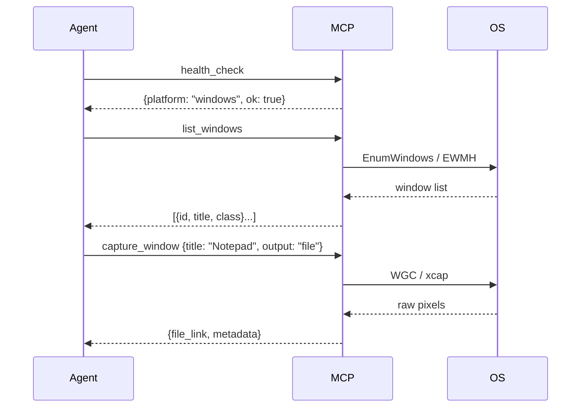
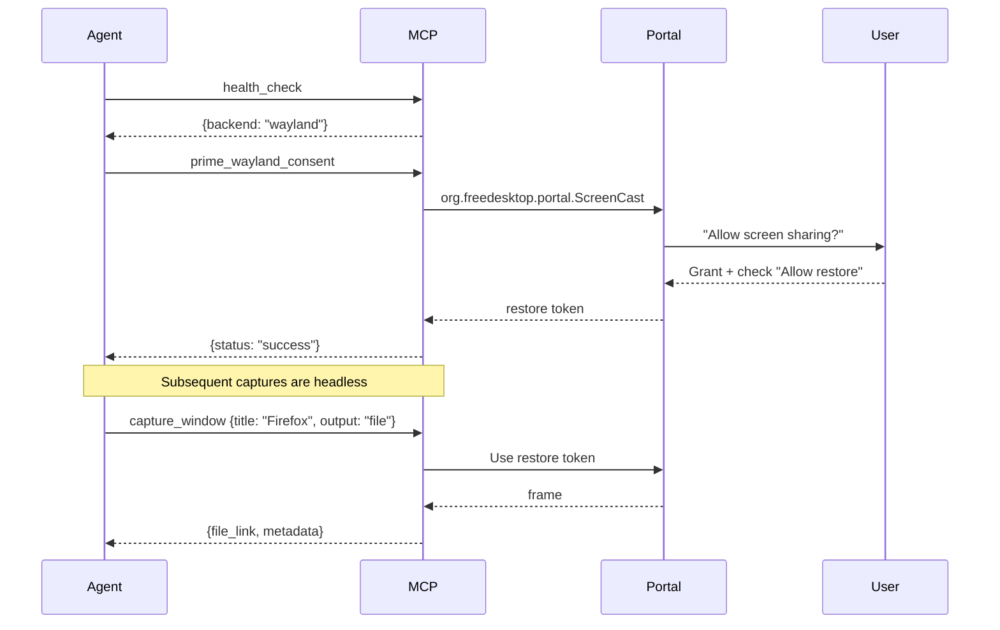

# Usage Guide

API reference and workflows for screenshot-mcp.

## Tools at a Glance

| Tool | Returns | When to Use |
|------|---------|-------------|
| `health_check` | platform, backend, ok | First call - detect environment |
| `list_windows` | id, title, class, owner | Find capture targets |
| `capture_window` | image, file link, metadata | Take screenshot (choose output mode) |
| `prime_wayland_consent` | token stored | Wayland only - one-time setup |

---

## health_check

Detects platform and backend status.

**Request:**
```json
{ "name": "health_check", "arguments": {} }
```

**Response:**
```json
{ "platform": "linux", "backend": "wayland", "ok": true }
```

---

## list_windows

Enumerates visible windows with metadata.

**Parameters:** None.

**Request:**
```json
{ "name": "list_windows", "arguments": {} }
```

**Response:**
```json
[
  {
    "id": "12345",
    "title": "Mozilla Firefox",
    "class": "firefox",
    "owner": "firefox",
    "pid": 1000,
    "backend": "wayland"
  }
]
```

---

## capture_window

Captures a screenshot of a specific window.

**Parameters:**

| Name | Type | Default | Description |
|------|------|---------|-------------|
| `titleSubstringOrRegex` | string | - | Window title substring or regex |
| `class` | string | - | Window class |
| `exe` | string | - | Executable name (Windows) |
| `format` | string | `"webp"` | `"webp"`, `"png"`, or `"jpeg"` |
| `quality` | number | 80 | 0-100 (webp/jpeg only) |
| `scale` | number | 1.0 | 0.1-2.0 resize factor |
| `output` | string | `"both"` | `"inline"`, `"file"`, or `"both"` |
| `includeCursor` | boolean | false | Include cursor in capture |
| `region` | object | - | Crop region `{x, y, width, height}` |

> **Note (v0.6.0):** Default format changed from PNG to WebP for better compression and agent-friendly payloads.

**Request:**
```json
{
  "name": "capture_window",
  "arguments": {
    "titleSubstringOrRegex": "Firefox",
    "output": "file",
    "format": "jpeg",
    "quality": 80,
    "scale": 0.5
  }
}
```

**Response (content varies by `output`):**

- `output: "both"` returns **image + file link + metadata**
- `output: "inline"` returns **image + metadata**
- `output: "file"` returns **file link + metadata**

Metadata includes `file_path`, which is **null** when no file was written (e.g. `output: "inline"`).

**Response example (`output: "both"`):**
```json
{
  "content": [
    { "type": "image", "mimeType": "image/jpeg", "data": "..." },
    { "type": "text", "text": "[Screenshot](file:///tmp/screenshot-mcp/screenshot-123.jpg)" },
    { "type": "text", "text": "## Capture Metadata\n```json\n{\"dimensions\": [960, 540], \"format\": \"jpeg\", \"quality\": 80, \"scale\": 0.5}\n```" }
  ]
}
```

---

## prime_wayland_consent

**Wayland only.** Opens the portal picker to obtain permission and store a restore token.

**Parameters:**

| Name | Type | Default | Description |
|------|------|---------|-------------|
| `sourceType` | string | `"monitor"` | `"monitor"`, `"window"`, or `"virtual"` |
| `sourceId` | string | `"wayland-default"` | Stable ID used to store/restore portal tokens |
| `includeCursor` | boolean | false | Include cursor in captures |

**Request:**
```json
{
  "name": "prime_wayland_consent",
  "arguments": { "sourceType": "monitor", "sourceId": "wayland-default", "includeCursor": false }
}
```

**User Action:** A system dialog appears. Select a window/screen and check "Allow restore" if available.

**Response:**
```json
{
  "status": "success",
  "source_id": "wayland-default",
  "next_steps": "Use capture_window for headless captures"
}
```

**Token Storage:**
- Keyring (gnome-keyring/kwallet) — preferred
- Encrypted file (`~/.local/share/screenshot-mcp/token-store.enc`) — fallback

---

## Workflows

### Basic Capture (Windows/X11)



### Wayland Capture



---

## Error Codes

| Code | Name | Description | Remediation |
|------|------|-------------|-------------|
| -32000 | PortalUnavailable | XDG Portal not found | Install `xdg-desktop-portal` |
| -32001 | WindowNotFound | Window doesn't exist | Run `list_windows` first |
| -32002 | PermissionDenied | Capture denied | Re-run `prime_wayland_consent` |
| -32003 | CaptureTimeout | Capture took too long | Check GPU/drivers |
| -32004 | EncodingError | Image encoding failed | Try different format |
| -32005 | TokenStoreError | Token save/load failed | Check keyring access |
| -32006 | PlatformError | General platform error | See logs |

**Error Response Example:**
```json
{
  "code": -32001,
  "message": "Window 'Notepad' not found",
  "data": { "hint": "Run list_windows to see available targets." }
}
```

---

## Best Practices

1. **Always call `health_check` first** — know your platform/backend
2. **List before capture** — don't guess window titles
3. **Use cropping** — reduce payload size, exclude sensitive areas
4. **Use WebP (default)** — best balance of quality and compression for agent interactions
5. **Handle token expiry** — Wayland tokens invalidate on compositor restart
6. **Prefer file output for large captures** — `output: "file"` avoids multi-megabyte base64 payloads
7. **Scale down large captures** — `scale: 0.5` reduces pixels by ~75%

---

## Platform Notes

### Linux - Wayland

- Requires one-time `prime_wayland_consent`
- Token expires on logout/compositor restart
- Install portal: `sudo apt install xdg-desktop-portal xdg-desktop-portal-gtk`

### Linux - X11

- Works directly via EWMH, no consent needed
- Ensure `DISPLAY` is set (usually `:0`)

### Windows

- Uses Windows Graphics Capture API (Windows 10 1803+)
- Yellow security border appears around captured window (OS feature)
- Cannot capture minimized windows
